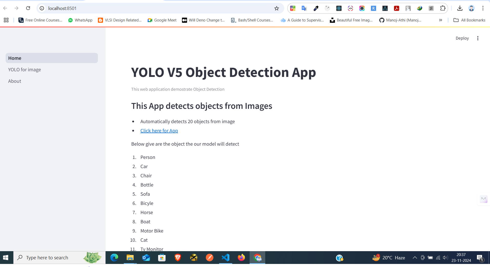
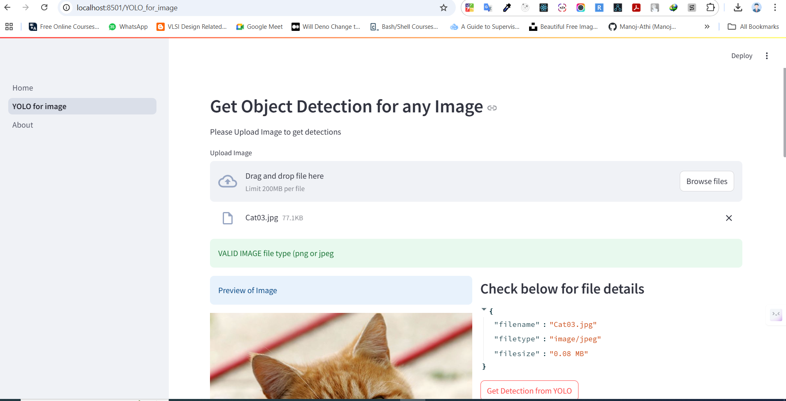
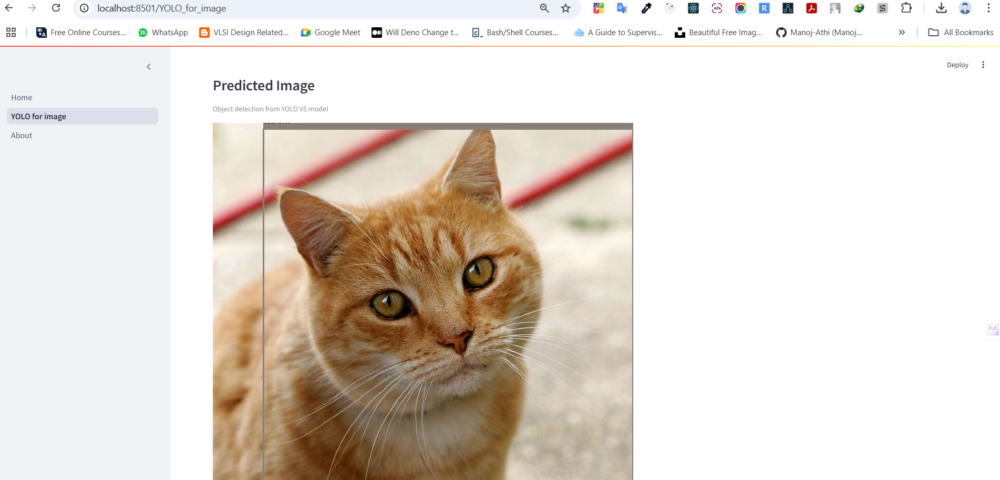
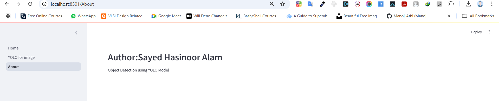

# YOLOv5 Object Detection Web Application

This web application leverages the **YOLOv5** object detection model to detect and classify objects in images. Designed with a user-friendly interface, it processes images and identifies up to 20 distinct objects.

---

## 🌟 Features

- **Real-time Object Detection**: Detect objects in uploaded images with high accuracy.
- **Multi-Object Support**: Automatically detects and classifies up to **20 object categories**.
- **Easy to Use**: Interactive web interface powered by **Streamlit**.
- **Custom Dataset Fine-Tuning**: Trained with a custom YOLOv5 model to ensure optimal performance.

---

## 🎯 Object Categories

The following objects can be detected by the application:

- **Person**  
- **Car**  
- **Chair**  
- **Bottle**  
- **Sofa**  
- **Bicycle**  
- **Horse**  
- **Boat**  
- **Motorbike**  
- **Cat**  
- **TV Monitor**  
- **Cow**  
- **Sheep**  
- **Aeroplane**  
- **Train**  
- **Dining Table**  
- **Bus**  
- **Potted Plant**  
- **Bird**  
- **Dog**

---

## 🌐 Live Demo

---

## 🖼️ Screenshots

### **1. Home Page**
The app's homepage provides a clean and intuitive interface to upload images and view results.



---

### **2. Object Detection Results**
Once an image is uploaded, the app highlights detected objects with bounding boxes and labels.



---

### **3. Example Output**
Here’s an example of the application identifying  objects in an image:



### **4. Example Output**
About Section



---

## 🚀 How to Run Locally

Follow these steps to set up and run the app on your local machine.

### **1. Prerequisites**
- Python 3.8 or higher
- `git` installed
- A virtual environment (optional but recommended)

### **2. Clone the Repository**
```bash
git clone https://github.com/your-username/your-repo-name.git
cd your-repo-name

##

### **3. Installation**
pip install -r requirements.txt

### **4. Run**
streamlit run app.py


